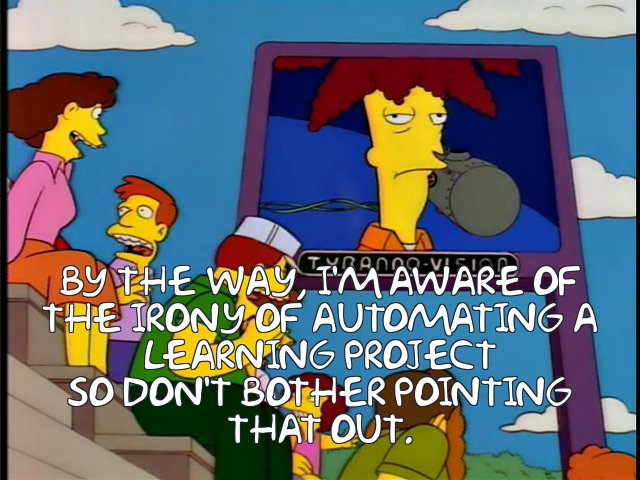
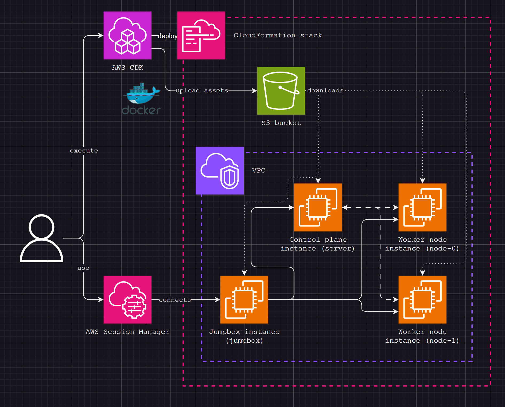
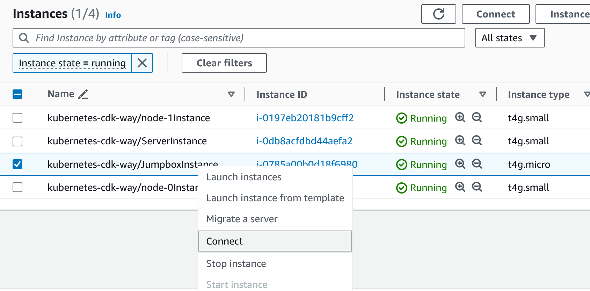
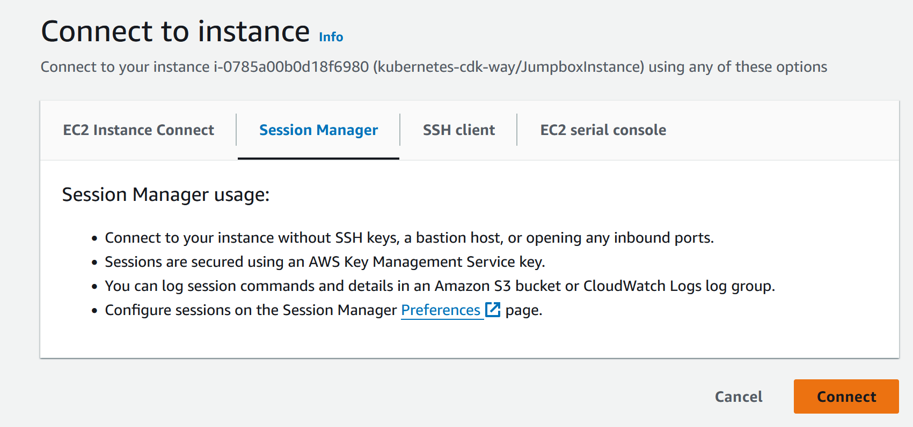

# Kubernetes the CDK Way

Working through [Kubernetes the Hard Way](https://github.com/kelseyhightower/kubernetes-the-hard-way) with a twist.



## Prerequisites

- Docker
- pnpm

## Installing

Install dependencies using `pnpm`

```sh
$ pnpm install
```

## Deploying



Execute CDK deployment via `pnpm`. Assets will be bundled in Docker and uploaded to S3.

```sh
$ pnpm exec cdk deploy
```

## Connecting

Log in to AWS Console

Navigate to EC2 Console

Locate `JumpboxInstance` and connect with AWS Session Manager





Kubernetes CLI already configured

```sh
$ kubectl version

```

## Running smoke tests

Run smoke tests from AWS Session Manager

```sh
$ /assets/smoke-test.sh
```

## Cleaning up

Delete CloudFormation stack using the CDK

```sh
$ pnpm exec cdk destroy --force
```